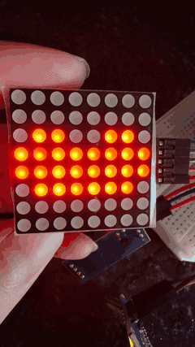
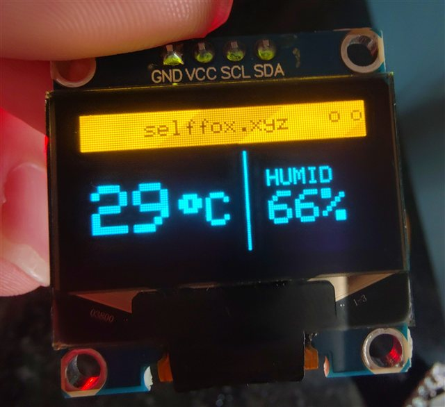

# ESP32-C3 温湿度气象站 🌡️

> 基于 **ESP32-C3 Super Mini** 的四合一桌面气象站：DHT11 采集温湿度，MAX7219 点阵播放爱心动画，OLED 实时显示界面，并通过 WiFi + MQTT 上传数据到云端。

[](https://platformio.org)
[](https://www.espressif.com/en/products/socs/esp32-c3)
[](https://opensource.org/licenses/MIT)

📖 详细教程：[ESP32-C3 温湿度计：DHT11 + OLED + WiFi/MQTT](https://selffox.xyz/posts/esp32-c3-super-minidht11/) · [ESP32-C3 点阵入门：心形与滚动文字](https://selffox.xyz/posts/esp32-c3-super-miniled/)

---

## ✨ 功能亮点

| 功能 | 实现 |
|------|------|
| 🌡️ 温湿度采集 | DHT11 单总线传感器，精度 ±2°C / ±5%RH，2s 采样间隔 |
| ❤️ LED 爱心动画 | MAX7219 驱动的 8×8 点阵，大/小心交替形成"跳动"效果 |
| 🖥️ OLED 界面 | SSD1306 128×64，顶部标题栏 + 温度/湿度分区显示 |
| 📶 联网上传 | WiFi STA 模式连接路由器，MQTT 协议上报 JSON 数据 |
| 🔄 自动重连 | WiFi / MQTT 断线后每 5s 自动重连，无需重启 |
| 📱 状态监控 | OLED 右上角状态点实时显示 WiFi / MQTT 连接状态 |
| 🔒 安全配置 | WiFi 密码等敏感信息独立于 `config.h`，不会上传到 GitHub |

## 🧰 硬件清单

| 器件 | 型号 | 数量 | 说明 |
|------|------|:---:|------|
| 开发板 | ESP32-C3 Super Mini | 1 | 主控，板载 4MB Flash |
| 温湿度传感器 | DHT11 模块 | 1 | 已集成 4.7kΩ 上拉电阻 |
| LED 点阵 | MAX7219 8×8 模块 | 1 | SPI 驱动，可级联 |
| OLED 显示屏 | SSD1306 0.96 寸 128×64 | 1 | I2C 接口，地址 0x3C |
| 面包板 / 杜邦线 | — | 若干 | 接线用 |

## 🔌 接线图

### MAX7219 点阵（SPI）

| MAX7219 模块 | ESP32-C3 |
|:---:|:---:|
| VCC | 3V3 |
| GND | GND |
| DIN | GPIO 3 |
| CLK | GPIO 0 |
| CS | GPIO 10 |

### DHT11 模块

| DHT11 模块 | ESP32-C3 |
|:---:|:---:|
| VCC (或 +) | 3V3 |
| GND (或 -) | GND |
| DATA (或 S) | GPIO 1 |

### SSD1306 OLED（I2C）

| OLED | ESP32-C3 |
|:---:|:---:|
| VCC | 3V3 |
| GND | GND |
| SDA | GPIO 4 |
| SCL | GPIO 6 |

> ⚠️ 引脚定义统一维护在 [`include/pins.h`](include/pins.h)，如接线不同只需改这一处。
>
> ⚠️ 建议所有外设共地（GND 相连），并注意供电电流，5V 模块不要直接接 3.3V 引脚。

## 🚀 快速开始

### 1. 安装开发环境

- 安装 [VS Code](https://code.visualstudio.com/) + [PlatformIO IDE 插件](https://platformio.org/install/ide?install=vscode)（推荐）
- 或使用 Arduino IDE + [esp32 开发板支持包](https://docs.espressif.com/projects/arduino-esp32/en/latest/installing.html)

### 2. 获取代码并配置

```bash
git clone https://github.com/Selffox/esp32-c3-weather-station.git
cd esp32-c3-weather-station
```

复制配置模板并填入你的信息：

```bash
cp include/config.example.h include/config.h
```

编辑 `include/config.h`，修改以下内容：

```cpp
// ----- WiFi -----
const char* WIFI_SSID       = "your_wifi_ssid";      // 你的 WiFi 名称
const char* WIFI_PASSWORD   = "your_wifi_password";  // 你的 WiFi 密码

// ----- MQTT -----
const char* MQTT_BROKER     = "broker.emqx.io";      // MQTT Broker
const int   MQTT_PORT       = 1883;
const char* MQTT_CLIENT_ID  = "esp32c3-dht11";       // 建议改成唯一值
const char* MQTT_TOPIC      = "selffox/dht11";       // 发布主题
```

### 3. 编译烧录

```bash
# PlatformIO（VSCode 打开项目后点 Upload 即可）
pio run -t upload

# 或使用串口监控查看日志
pio device monitor
```

### 4. 订阅查看数据

用任意 MQTT 客户端（如 [MQTTX](https://mqttx.app/)）订阅主题，即可收到：

```json
{"temperature":25.3,"humidity":58.0}
```

默认使用公共 Broker `broker.emqx.io:1883`（免费，无需注册）。

## 📁 代码结构

```
esp32-c3-weather-station/
├── LICENSE                  # MIT 许可证
├── platformio.ini            # 平台/板型/依赖库配置
├── .gitignore                # 忽略 .pio/、config.h 等
├── README.md
├── include/
│   ├── config.h              # ★ 个人配置（WiFi 密码等，不提交）
│   ├── config.example.h      # 配置模板（可提交）
│   └── pins.h                # 引脚定义
├── src/
│   └── main.cpp              # 主程序
├── docs/
│   └── images/               # 效果展示图片与视频
├── lib/README                # 第三方库说明
└── test/README               # 测试目录说明
```

### 主程序模块划分（`src/main.cpp`）

| 函数 | 职责 |
|------|------|
| `updateHeart()` | MAX7219 爱心跳动动画（非阻塞） |
| `drawScreen(t, h)` | OLED 温湿度界面 + 连接状态点 |
| `ensureWiFi()` | WiFi 断线自动重连 |
| `ensureMQTT()` | MQTT 断线自动重连 |
| `readAndDisplay()` | 读 DHT11 → 刷 OLED → MQTT 发布 |
| `setup()` / `loop()` | 初始化 / 主循环（全部非阻塞） |

## 📸 效果展示

| MAX7219 爱心跳动 | OLED 温湿度界面 |
|:---:|:---:|
|  |  |

> GIF 演示爱心心跳动画；实拍 OLED 显示温度、湿度与右上角 WiFi/MQTT 状态点。

## ❓ 常见问题（FAQ）

### Q1: DHT11 读取返回 `nan`？
DHT11 采样间隔必须 **≥ 1 秒**，读取太频繁会返回 `nan`。本项目默认 2s 间隔；如仍出现，检查传感器接线（数据线接 `PIN_DHT`）和供电是否稳定。

### Q2: WiFi 一直连不上？
- ESP32-C3 **只支持 2.4GHz**，不支持 5GHz 网络
- 确认 `include/config.h` 里的 `WIFI_SSID` / `WIFI_PASSWORD` 拼写无误（大小写、下划线）
- 检查路由器是否开启了 MAC 地址过滤 / 设备白名单
- 确认密码正确（可在电脑 `netsh wlan show profile name="你的SSID" key=clear` 查看真实密码对比）

### Q3: LED 点阵完全不亮？
- 检查 MAX7219 的 `VCC` / `GND` 供电是否接好、是否共地
- 确认 DIN / CLK / CS 三根信号线对应 `include/pins.h` 的引脚定义
- 若模块通电但无显示，尝试降低亮度（`setIntensity(10)` 改小）

### Q4: 修改引脚后没生效？
所有引脚集中在 [`include/pins.h`](include/pins.h)，改完需重新编译烧录。

## 🔗 参考教程

- [ESP32-C3 温湿度计：DHT11 + OLED + WiFi/MQTT](https://selffox.xyz/posts/esp32-c3-super-minidht11/) —— 本文项目配套教程
- [ESP32-C3 点阵入门：心形与滚动文字](https://selffox.xyz/posts/esp32-c3-super-miniled/) —— MAX7219 点阵驱动详解
- [PlatformIO 官方文档](https://docs.platformio.org)
- [EMQX 公共 MQTT Broker](https://www.emqx.io/zh)

## 📜 开源协议

本项目代码遵循 [MIT License](LICENSE)。

---

© 2026 [Fox](https://selffox.xyz) | [个人博客](https://selffox.xyz) | [GitHub](https://github.com/Selffox)
